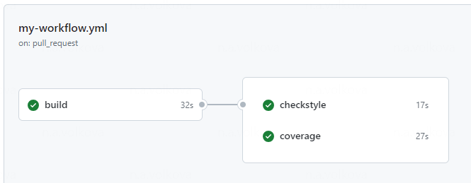
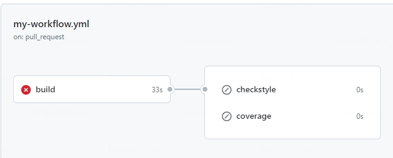
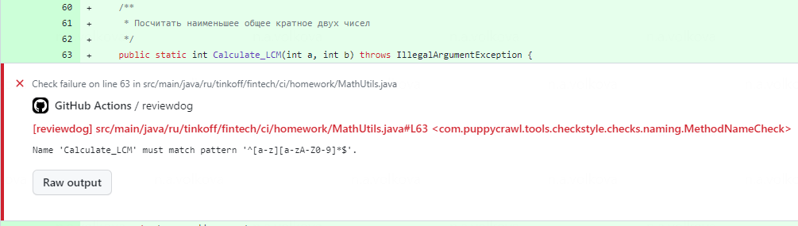
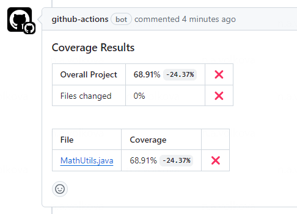

# Домашнее задание

Работайте в отдельной ветке и создайте пулл реквест с изменениями.

### Проект

Проект - простое приложение на java. `ru.fintech.ci.homework.MathUtils` - класс с разными математическими методами.

`ru.fintech.ci.homework.MathUtilsTest` - класс с юнит-тестами.

`build.gradle` содержит необходимую конфигурацию для:

- Checkstyle - статический анализ кода
- Jacoco - подсчет покрытия кода юнит-тестами 

###### Важно

Раскомментируйте методы `Calculate_LCM` и `Calculate_GCD` в классе `MathUtils` (как будто вы написали их в своей задаче), но не меняйте.

### CI

Необходимо настроить GitHub Actions Workflow, создать файл`.github/workflows/my-workflow.yml`.

Ваш workflow должен иметь 3 задачи. `checkstyle` и `coverage` должны зависеть от `build`.

##### build

Сборка проекта с помощью `gradle clean build`.

Вам надобится action `actions/checkout@v3`.

Убедиться, что из-за падающего теста `testPrimeFactorizationNegativeNumber` падает весь workflow.

Необходимо выключить падающий тест `testPrimeFactorizationNegativeNumber`.

##### checkstyle

Запуск статического анализатора кода.

Чтобы результаты анализа отображались в пулл реквесте, используйте action `nikitasavinov/checkstyle-action@master`. Настройте его самостоятельно в соответствии с [документацией](https://github.com/nikitasavinov/checkstyle-action).

###### Ожидаемый результат

2 ошибки от Checkstyle, связанные с названиями методов `Calculate_LCM` и `Calculate_GCD`:

##### coverage

Анализ собранных данных о покрытии (jacoco собирает данные во время запуска тестов).

Собрать отчет о покрытии можно командой `gradle jacocoTestReport`. Результат будет находиться в папке `build/reports/jacoco/test`.

Для отправки отчета о покрытии в pull request использовать action `madrapps/jacoco-report@v1.6.1` ([документация](https://github.com/madrapps/jacoco-report)).

###### Ожидаемый результат

На главной странице pull request комментарий с результатами покрытия. Новые методы в `MathUtils` не покрыты тестами, поэтому покрытие будет неудовлетворительным.

### Доп задания:

- `madrapps/jacoco-report` по умолчанию оставляет новый комментарий каждый раз. Сделать так, чтобы при каждом прогоне редактировался старый комментарий.
- Сделать так, чтобы для сбора покрытия юнит-тесты не запускались во второй раз. Для этого необходимо передать результаты покрытия `build/jacoco` из задачи `build`.
